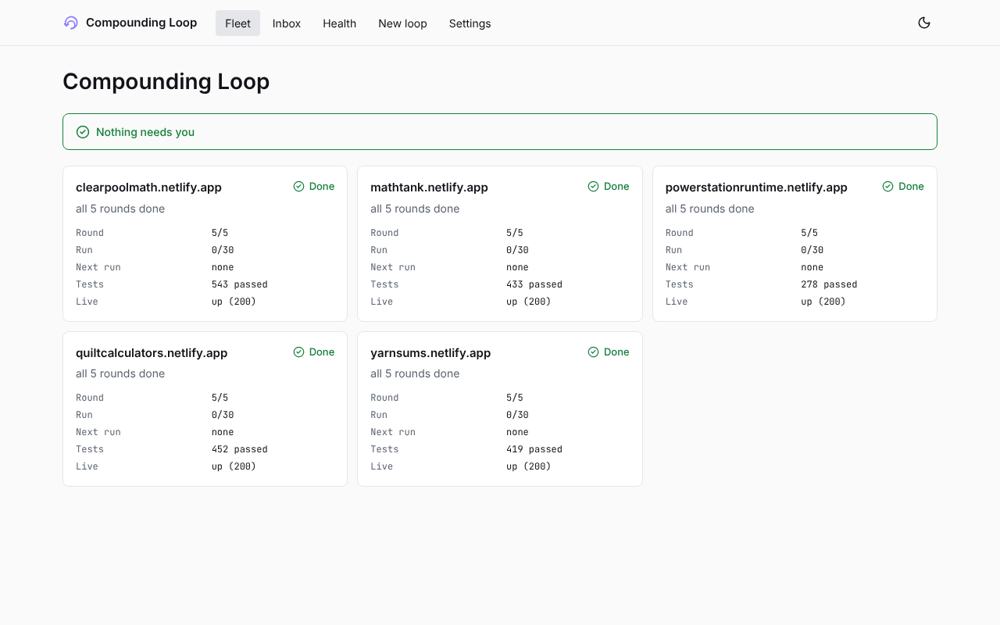
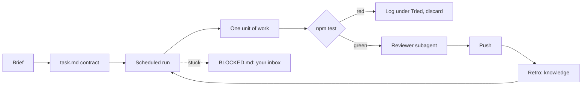

# Compounding Loop

**Write the brief, check back tomorrow.** Unattended, verified Claude Code build loops with a local dashboard.

```sh
npx compounding-loop init
```



Most agent tools show a demo. This one ships with proof: the method in this repo built five live sites, 215 pages in all, with nobody watching, and made **verification** the product. A round only counts when the repo's own tests pass and a reviewer that did not write the code has checked the diff.

## Proof

Five calculator sites, each built by scheduled Claude Code runs working from a written brief. Numbers come from the repo data in [`demo/five-sites.json`](demo/five-sites.json).

| Site | Pages | Tests passing | Commits | Rounds | Elapsed* |
|---|---:|---:|---:|---:|---:|
| [powerstationruntime.netlify.app](https://powerstationruntime.netlify.app) | 55 | 278 | 112 | 5 / 5 | 22 h |
| [clearpoolmath.netlify.app](https://clearpoolmath.netlify.app) | 40 | 543 | 83 | 5 / 5 | 22 h |
| [yarnsums.netlify.app](https://yarnsums.netlify.app) | 40 | 419 | 109 | 5 / 5 | 19 h |
| [quiltcalculators.netlify.app](https://quiltcalculators.netlify.app) | 43 | 452 | 77 | 5 / 5 | 18 h |
| [mathtank.netlify.app](https://mathtank.netlify.app) | 37 | 433 | 83 | 5 / 5 | 18 h |
| **Total** | **215** | **2,125** | **464** | | |

\*Wall-clock time from the first to the last commit, rounded. It is not the time a human spent: that was writing five briefs.

## How it works



1. **Brief and contract.** You write what "done" means as commands that can be checked.
2. **Scheduled runs.** A routine, a GitHub Action or `loop run` wakes up, reads its task file and does one unit at a time.
3. **Checks decide.** The agent never declares itself done; `npm test` does.
4. **Reviewer gate.** A fresh subagent attacks the diff before it is pushed.
5. **Compounding.** Every run writes what it learned into a small indexed knowledge base the next run reads first.
6. **Escalation.** When it is stuck it writes `BLOCKED.md`. You answer from the dashboard inbox or `loop answer`.

## Quick start

```sh
npx compounding-loop new static-site my-site   # a new loop repo from a template
cd my-site
npx compounding-loop run                       # one round now
npx compounding-loop dashboard                 # the local dashboard
```

Already have a repo? `npx compounding-loop init` adds the method to it without overwriting anything. Details: [Getting started](docs/getting-started.md).

## Just loop the agent?

An honest comparison with `while true; do claude -p "keep going"; done`:

| | Plain loop | Compounding Loop |
|---|---|---|
| Knows when it is done | When the model says so | When your checks pass |
| Reviews its own work | Same context, same blind spots | A fresh reviewer must find no blockers |
| Survives context limits | Starts cold every time | Writes a handoff the next run resumes from |
| Learns from mistakes | No | Notes and a retro, indexed |
| Overlapping runs | Collide on the same files | Session lock |
| Stuck for hours | Burns budget | Run budget, then `BLOCKED.md` |
| You can see what happened | `git log` | Fleet dashboard and inbox |

If your task is one afternoon of work and you are at the keyboard, a plain loop is fine. This pays off for work that runs for days.

## Docs

[Getting started](docs/getting-started.md) · [Concepts](docs/concepts.md) · [Runners](docs/runners.md) · [Dashboard](docs/dashboard.md) · [Templates](docs/templates.md) · [FAQ](docs/faq.md) · [Troubleshooting](docs/troubleshooting.md) · [Contributing](CONTRIBUTING.md)

## FAQ

**What does it cost?** The tool is free and MIT licensed. Your Claude Code plan pays for the runs; the budget (`Run: N / LIMIT`) caps how many happen.

**Is it safe?** The dashboard binds to loopback, there is no telemetry and no call home, and tokens come from your environment or `gh` and are never stored. The loop works on branches or `main` as you configure; read [SECURITY.md](SECURITY.md).

**What won't it do?** It will not publish, spend money, create accounts or change repo settings on its own, and it stops and asks (`BLOCKED.md`) rather than guess when the brief contradicts reality.

**Does it need a GitHub login?** Only to create a private repo with `loop new`; `--dry-run` and every test work offline.

## License

MIT. See [LICENSE](LICENSE).
