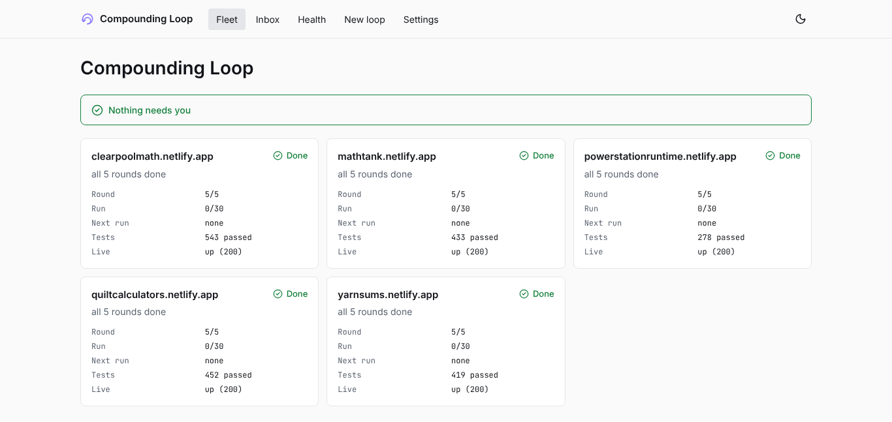
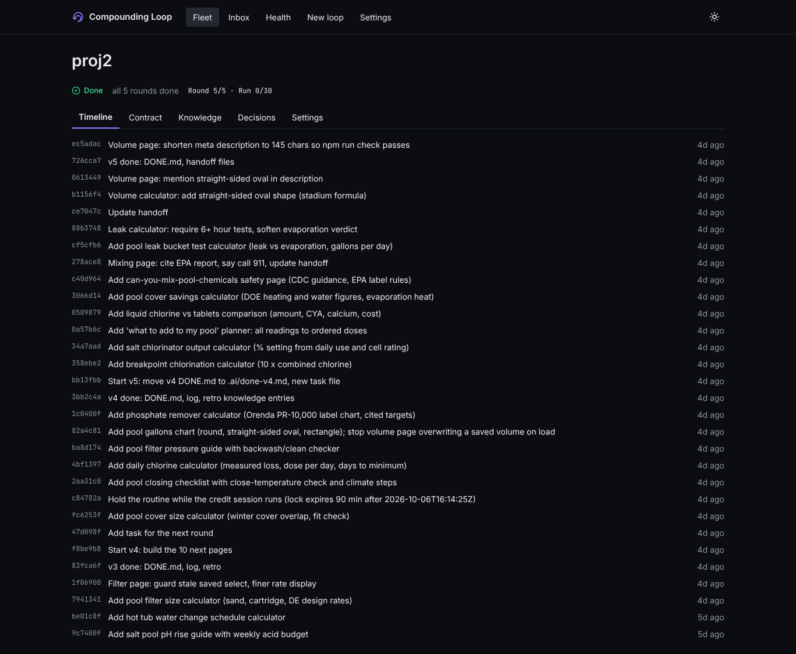
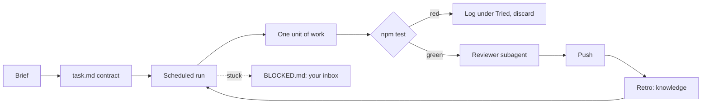

# Compounding Loop

**Write the brief, check back tomorrow.** Several unattended Claude Code lanes, one repo, each lane owning its own paths so they do not step on each other, every round verified by your own tests. Local dashboard included.

```sh
npx compounding-loop init
```

[](https://www.npmjs.com/package/compounding-loop) [](https://github.com/Minntooos/Compounding-Loop/actions/workflows/ci.yml) [](LICENSE)

**[Live demo](https://minntooos.github.io/Compounding-Loop/)**: the dashboard on the real five-site data, in your browser.





**Lanes:** each lane is a scheduled run that owns a set of paths (`.ai/lanes.json`). `loop check-lanes` fails any commit that touches files outside its lane, so parallel runs do not collide. This repo is the proof: five lanes (core, kit, server, web, docs) built and documented it by pushing to one `main`. See [Lanes](docs/lanes.md).

Most agent tools show a demo. This one ships with proof: the method in this repo built five live sites, 215 pages in all, with nobody watching, and made **verification** the product. A round only counts when the repo's own tests pass and a reviewer that did not write the code has checked the diff.

## Proof

Five calculator sites, each built by scheduled Claude Code runs working from a written brief. Numbers come from the repo data in [`demo/five-sites.json`](demo/five-sites.json).

| Site | Pages | Tests passing | Commits | Rounds | Elapsed* |
|---|---:|---:|---:|---:|---:|
| [powerstationruntime.netlify.app](https://powerstationruntime.netlify.app) | 55 | 278 | 112 | 5 / 5 | 22 h |
| [clearpoolmath.netlify.app](https://clearpoolmath.netlify.app) | 40 | 543 | 83 | 5 / 5 | 22 h |
| [yarnsums.netlify.app](https://yarnsums.netlify.app) | 40 | 419 | 109 | 5 / 5 | 19 h |
| [quiltcalculators.netlify.app](https://quiltcalculators.netlify.app) | 43 | 452 | 77 | 5 / 5 | 18 h |
| [mathtank.netlify.app](https://mathtank.netlify.app) | 37 | 433 | 83 | 5 / 5 | 18 h |
| **Total** | **215** | **2,125** | **464** | | |

\*Wall-clock time from the first to the last commit, rounded. It is not the time a human spent: that was writing five briefs.

## How it works



1. **Brief and contract.** You write what "done" means as commands that can be checked.
2. **Scheduled runs.** A routine, a GitHub Action or `loop run` wakes up, reads its task file and does one unit at a time.
3. **Checks decide.** The agent never declares itself done; `npm test` does.
4. **Reviewer gate.** A fresh subagent attacks the diff before it is pushed.
5. **Compounding.** Every run writes what it learned into a small indexed knowledge base the next run reads first.
6. **Escalation.** When it is stuck it writes `BLOCKED.md`. You answer from the dashboard inbox or `loop answer`.

## Quick start

```sh
npx compounding-loop new static-site my-site   # a new loop repo from a template
cd my-site
npx compounding-loop run                       # one round now
npx compounding-loop dashboard                 # the local dashboard
```

Several lanes in one repo: `npx compounding-loop init --lanes core,web,docs`, then `npx compounding-loop run --lane core`. Check ownership with `npx compounding-loop check-lanes`. Details: [Lanes](docs/lanes.md).

Already have a repo? `npx compounding-loop init` adds the method to it without overwriting anything. Details: [Getting started](docs/getting-started.md).

## Just loop the agent?

An honest comparison with `while true; do claude -p "keep going"; done`:

| | Plain loop | Compounding Loop |
|---|---|---|
| Knows when it is done | When the model says so | When your checks pass |
| Reviews its own work | Same context, same blind spots | A fresh reviewer must find no blockers |
| Survives context limits | Starts cold every time | Writes a handoff the next run resumes from |
| Learns from mistakes | No | Notes and a retro, indexed |
| Overlapping runs | Collide on the same files | Session lock |
| Stuck for hours | Burns budget | Run budget, then `BLOCKED.md` |
| You can see what happened | `git log` | Fleet dashboard and inbox |

If your task is one afternoon of work and you are at the keyboard, a plain loop is fine. This pays off for work that runs for days.

## How it differs from other tools

These tools solve a neighbouring problem: running several agents side by side while you watch. Compounding Loop is for work that runs unattended and has to prove itself. Descriptions come from each project's own page (checked 2026-10-08).

| Tool | What it is for | Where Compounding Loop differs |
|---|---|---|
| [Claude Squad](https://github.com/smtg-ai/claude-squad) | A terminal app that manages several agents, each in its own tmux session and git worktree; an experimental `-y` flag auto-accepts prompts. | Squad isolates work by branch. We isolate by path ownership on one `main`, and a round only counts when your tests and a reviewer pass. |
| [Parallel Code](https://github.com/johannesjo/parallel-code) | Runs several agents at once, each in its own git worktree; you merge the branch back yourself. | Interactive and merge-driven. We are scheduled, and the agent never marks itself done. |
| [Agent Orchestrator](https://github.com/ComposioHQ/agent-orchestrator) | A local desktop workspace where an orchestrator delegates work to agents on separate branches and worktrees, shown on a Kanban board. | A desktop planner. We are a plain-file method (task file, notes, handoffs) you can read in git. |
| [Vibe Kanban](https://github.com/BloopAI/vibe-kanban) | Plan issues on a kanban board, then run coding agents in workspaces with a branch and a terminal. Its page says it is sunsetting. | We have no board; the contract is a file of checkable commands. |
| [Claude Code agent teams](https://code.claude.com/docs/en/agent-teams) | Experimental, off by default: a lead session coordinates teammates with a shared task list and messages. Needs an interactive session (not `claude -p`). | Teams are live and interactive. Lanes are scheduled, unattended and leave a git trail. They can be combined. |

If you work at the keyboard and want to watch agents in parallel, those tools are a good fit.

## Docs

[Getting started](docs/getting-started.md) · [Lanes](docs/lanes.md) · [Concepts](docs/concepts.md) · [Runners](docs/runners.md) · [Dashboard](docs/dashboard.md) · [Templates](docs/templates.md) · [FAQ](docs/faq.md) · [Troubleshooting](docs/troubleshooting.md) · [Contributing](CONTRIBUTING.md)

## FAQ

**Isn't this cron + `claude -p`?** Partly, and the table above shows what is added: your checks decide when a round is done, a fresh reviewer attacks the diff, each run writes a handoff and notes the next run reads, a run budget stops runaway loops, and lanes keep parallel runs out of each other's files.

**What does it cost (plan usage vs API)?** The tool is free and MIT licensed. Runs use whatever your Claude Code login uses: plan usage on a subscription, or API billing if you authenticate with a key. The `Run: N / LIMIT` budget caps how many runs happen. More lanes means more runs, so cost scales with lanes times runs.

**Why not agent teams?** Agent teams are experimental, off by default and need an interactive session ([docs](https://code.claude.com/docs/en/agent-teams)). Lanes are for scheduled runs nobody is watching. Use teams when you are at the keyboard; use lanes when you are away.

**What happens when it goes wrong?** A red round is discarded and logged under Tried. The same failure twice triggers the stuck protocol, then a `BLOCKED.md` appears in your dashboard inbox. When the run budget is reached the lane stops. Everything is a git commit, so it is reversible. See [Troubleshooting](docs/troubleshooting.md).

**Is my code sent anywhere?** Only what Claude Code and git already send. Compounding Loop has no telemetry and no call home, the dashboard binds to loopback, and tokens come from your environment or `gh` and are never stored. See [SECURITY.md](SECURITY.md).

**What won't it do?** It will not publish, spend money, create accounts or change repo settings on its own, and it stops and asks (`BLOCKED.md`) rather than guess.

**Does it need a GitHub login?** Only to create a private repo with `loop new`; `--dry-run` and every test work offline.

## License

MIT. See [LICENSE](LICENSE).
